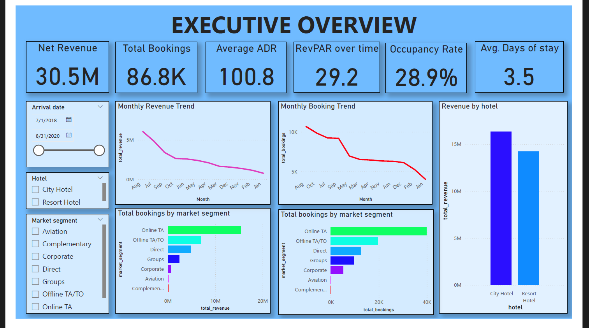
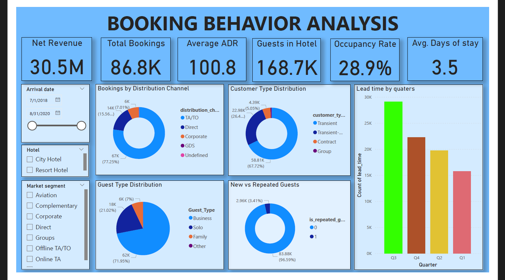
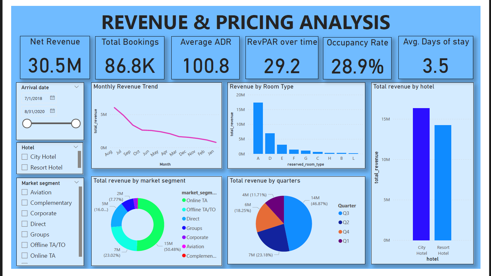
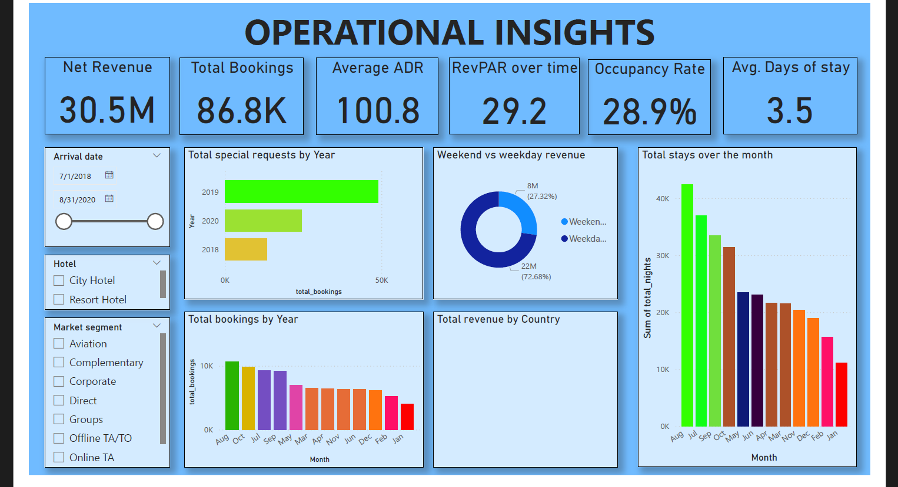

HotelRevAI – Hotel Revenue Analysis Project

About the Project
HotelRevAI is a data analytics project where I worked on a raw hotel booking dataset, cleaned it, and turned it into useful business insights using Power BI. The goal was to understand how hotels can improve their **revenue, occupancy, and customer experience** using data.

Tools Used
* Power BI
* Power Query
* DAX
* Data Modeling (Star Schema)

What I Did
* Cleaned and transformed raw data (handled missing values & duplicates)
* Built a proper data model (fact & dimension tables)
* Created important KPIs like:
  * Occupancy Rate
  * ADR (Average Daily Rate)
  * RevPAR
* Designed interactive dashboards

Key Analysis
*  Revenue & occupancy trends
*  Customer segmentation (loyal, new, business, etc.)
*  Cancellation patterns
*  Basic forecasting of bookings

Insights
* Identified peak booking periods
* Found major reasons behind cancellations
* Suggested ways to improve pricing and revenue

Challenges
* Messy and inconsistent data
* Complex DAX calculations
* Designing clean dashboards

  
What I Learned
* Power BI dashboarding
* Data cleaning & modeling
* Turning data into real business insights

Final Note

This project shows how raw data can be converted into meaningful insights that help businesses make better decisions.
These are the dashboard views:

